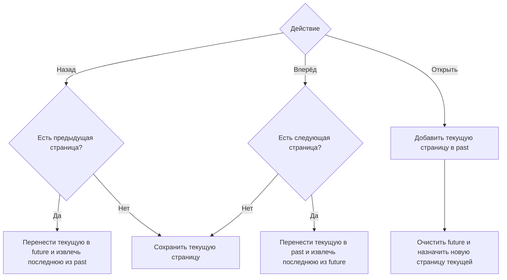

# История переходов

```mermaid
flowchart TD
    A{"Действие"} -->|Назад| B{"Есть предыдущая страница?"}
    A -->|Вперёд| C{"Есть следующая страница?"}
    A -->|Открыть| D["Добавить текущую страницу в past"]
    B -->|Да| E["Перенести текущую в future и извлечь последнюю из past"]
    C -->|Да| F["Перенести текущую в past и извлечь последнюю из future"]
    B -->|Нет| G["Сохранить текущую страницу"]
    C -->|Нет| G
    D --> H["Очистить future и назначить новую страницу текущей"]
```

Ближайшая доступная страница хранится на правом конце соответствующего дека.
