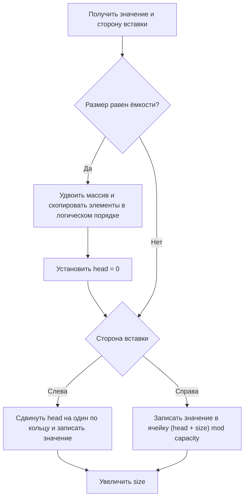

# Вставка в кольцевой дек

```mermaid
flowchart TD
    A["Получить значение и сторону вставки"] --> B{"Размер равен ёмкости?"}
    B -->|Да| C["Удвоить массив и скопировать элементы в логическом порядке"]
    C --> D["Установить head = 0"]
    D --> E{"Сторона вставки"}
    B -->|Нет| E
    E -->|Слева| F["Сдвинуть head на один по кольцу и записать значение"]
    E -->|Справа| G["Записать значение в ячейку (head + size) mod capacity"]
    F --> H["Увеличить size"]
    G --> H
```

Расположение узлов двусвязного списка и ячеек кольцевого дека показано на
[схеме хранения](../figures/structures.png).
